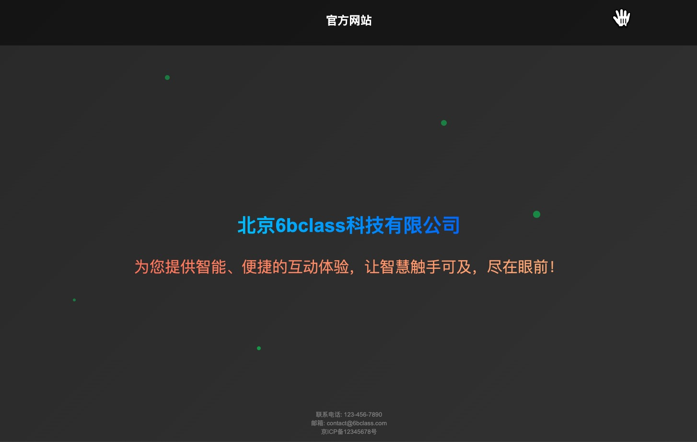

# official-website

免费、纯静态、简单、直接使用、纯文本的官方网站模板。

## 为什么有这个模板？

### 痛点描述

在国内，每申请一个域名，如果想要在国内合法访问，就必须进行备案。备案的前提条件是你需要有一个备案网站，并且还得有一个国内主机。此外，网站上还需要挂备案号，这样你的域名才能长期有效地被访问。实际上，这个备案网站基本上没有什么实际用途。因此，只需要一个能够供访问的页面即可。功能过多反而有时会被信管部门扫描出一堆漏洞，要求修改。因此，写一个通用的、供备案用的静态页面的想法油然而生。

### 纯静态网站的优点

纯静态网站具有许多优点：

- 无需服务器：无需配置复杂的服务器环境。
- 无需数据库：避免了数据库管理的麻烦。
- 无需框架：不依赖任何框架，减少了学习和维护的成本。
- 无需代码：只需要简单的文本文件，极其易于创建和管理。

## 示例



## 部署

- nginx 配置配置文件

```shell
server {
    listen 80;
    server_name example.com www.example.com;

    root /var/www/6bclass;
    index index.html;

    location / {
        try_files $uri $uri/ =404;
    }

    # Optional: Redirect HTTP to HTTPS
    # Uncomment the following lines if you have SSL configured
    # listen 443 ssl;
    # ssl_certificate /path/to/your/certificate.crt;
    # ssl_certificate_key /path/to/your/private.key;
    #
    # location / {
    #     try_files $uri $uri/ =404;
    # }

    # Optional: Redirect HTTP to HTTPS
    # if ($scheme != "https") {
    #     return 301 https://$host$request_uri;
    # }

    # Optional: Enable gzip compression for better performance
    # gzip on;
    # gzip_types text/plain text/css application/json application/javascript text/xml application/xml application/xml+rss text/javascript;

    # Optional: Add caching headers for static assets
    # location ~* \.(jpg|jpeg|png|gif|ico|css|js)$ {
    #     expires 30d;
    #     add_header Cache-Control "public, no-transform";
    # }
}

```

## 广告

在运维领域积累了多年丰富的知识和实践。如果您在运维方面有任何需求，欢迎随时与我联系(见主页)！可提供专业、高效的运维服务。
